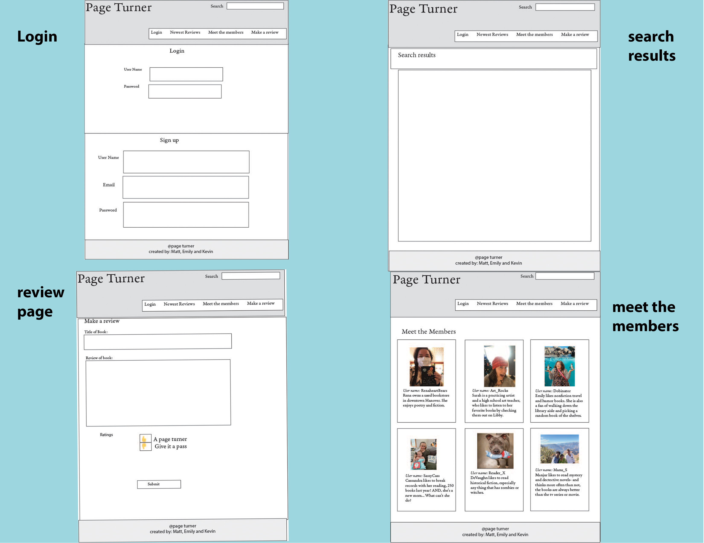

# Page-Turner

## Description:
App that allows users to log in, write book reviews, comment on others reviews, and browse reviews. There is a privacy function of requiring the user to be signed up in order to add a review, comment, and view members. 

## Index: 
* User Story
* Technologies Used
* Breakdown of Roles
* Wireframes
* Database Visualization
* Heroku- deployment
* Contact

## User Story

I am a Reader who wants to be able to share my opinions about books and read other's opinions. 

## Technologies Used

This application will be written in Javascript, HTML, and CSS and make use of Node, Express, Sequelize, Google Books API, Handlebars, and the npm package Cloudinary with Multer.

## Breakdown of Roles
All team members will collaborate on a wild variety of assignments but the primary roles will be:  
* Kevin: Frontend design 
* Matthew: Backend architecture  
* Emily: Database models 

## Wireframes  

## Database Visualization  

## Heroku
https://page-turner-mj-ed-kr.herokuapp.com/

## Contact

https://github.com/MatthewRonaldJohnson

https://github.com/007krm

https://github.com/dobinator
