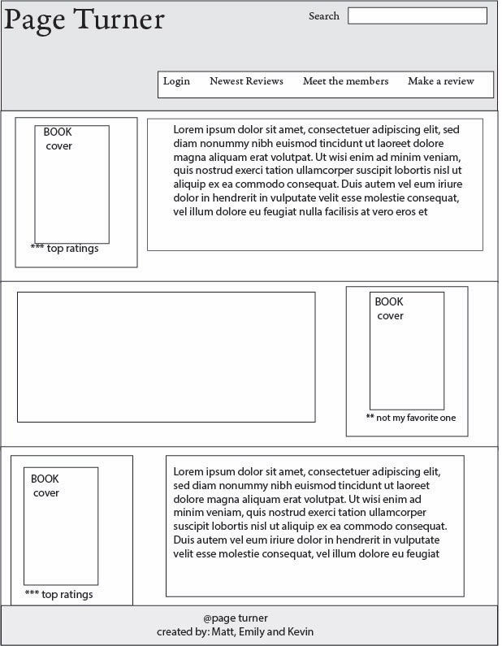
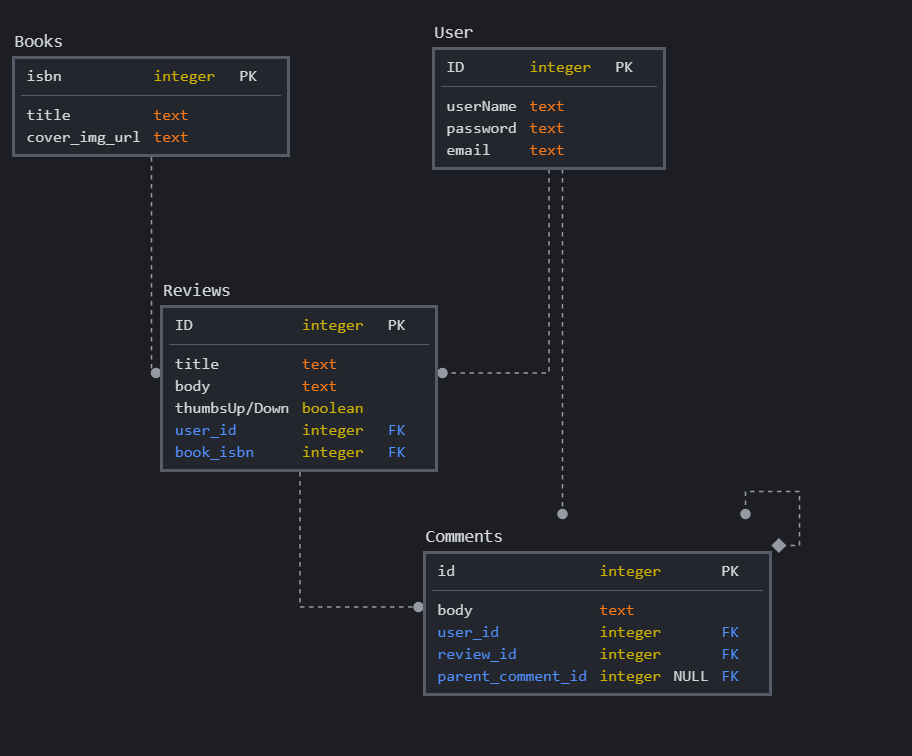

# Page-Turner
App that allows users to log in, write book reviews, comment on others reviews, and browse reviews. 

## User Story

I am a Reader who wants to be able to share my opinions about books and read other's opinions.

## Technologies Used

This application will be written in Javascript, HTML, and CSS and make use of Node, Express, Sequelize, Google Books API, Handlebars, and the npm package Passport. 

## Breakdown of Roles
All team members will collaborate on a wild variety of assignments but the primary roles will be:  
Kevin: Frontend design 
Matthew: Backend architecture  
Emily: Database models 

## Wireframes  

## Database Visualization  
